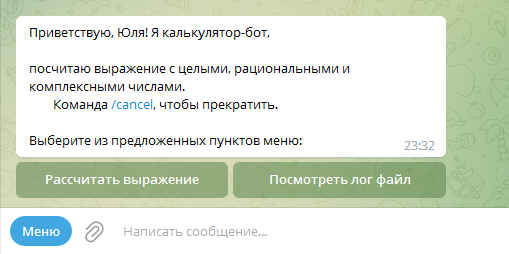
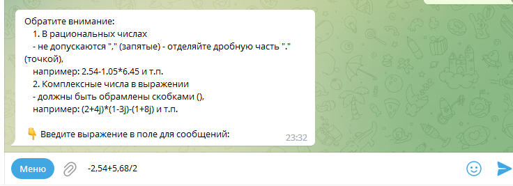
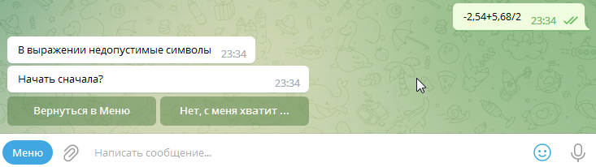
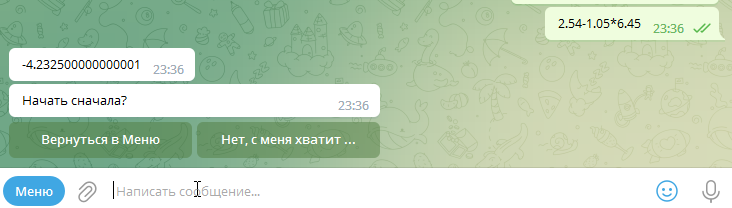
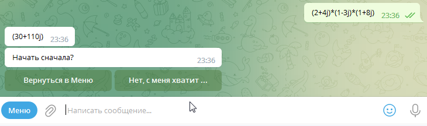
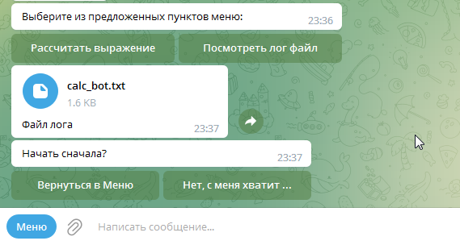
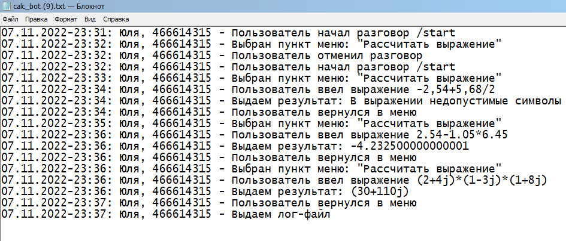
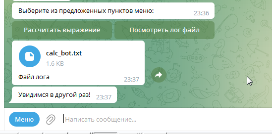
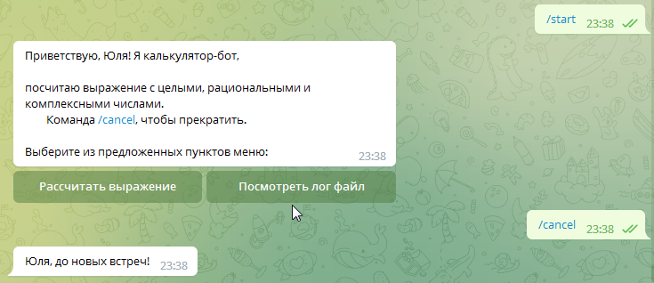

## Создать калькулятор для работы с рациональными и комплексными числами, организовать меню, добавив в неё систему логирования/ Прикрутить бота

Применяется библиотека python-telegram-bot в Python.
***

Используемые команды:

/start - запуск бота, начальная точка обработчика сообщений ConversationHandler

/cancel - завершающая точка обработчика

    Возможные пункты меню:
    1 - рассчитать выражение
    2 - посмотреть лог файл
    3 - выйти из программы - будет предлагаться после отработки первого шага, на втором этапе, или командой /cancel

Поступающее сообщение проверяется на допустимые символы - выдается соответствующее сообщение путем изменения предыдущего уровня меню. 

Таким образом, создается интерактивность диалога.

После каждого ответа бот предлагает вернуться в меню на уровень выше, либо завершить диалог.

Логи отправляются пользователю файлом

где фиксируются дата/время, имя/id пользователя, выбранные пункты и команды, введенные и полученные данные:

Нажатие кнопки "Нет" приводит к завершению диалога и затирает предыдущие кнопки меню

edit_message_text используется в такой степени, чтоб сохранились результаты вывода, а также логичная последовательность информации.

Команда Отмена также останавливает разговор.
Начать его можно командой Старт.

**Модули в проекте:**

*main* - запуск бота и описание диспетчера с переданным порядком обработчиков разговора.

*bot_commands* - описываются сами команды для диспетчера, каждая из которых вызывает запись в лог и возвращает определенный этап разговора, используемый в main в ConversationHandler.

Все расчеты импортируются из модуля *calc*, который в свою очередь обращается: 

к *calc_c* - в случае, если выражение содержит комплексные числа

к *calc_r* - в случае с рациональными числами (здесь програма умеет считать одинарные и вложенные скобки и учитывать знак "-" перед числами)

*logger* содержит функцию, определяющую порядок и формат записи лога в файл
